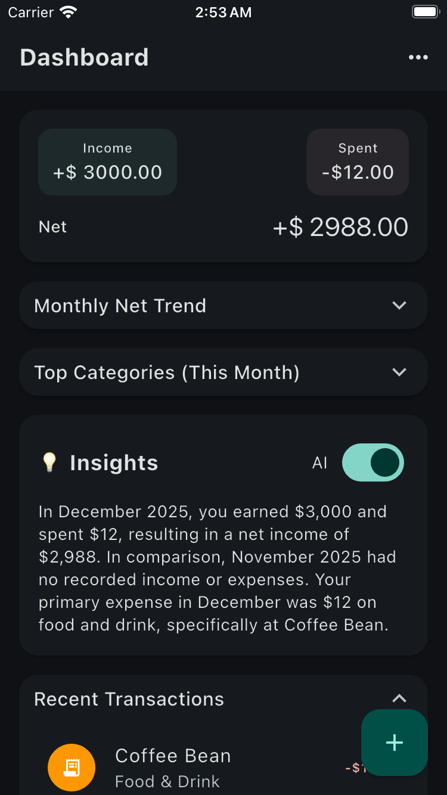
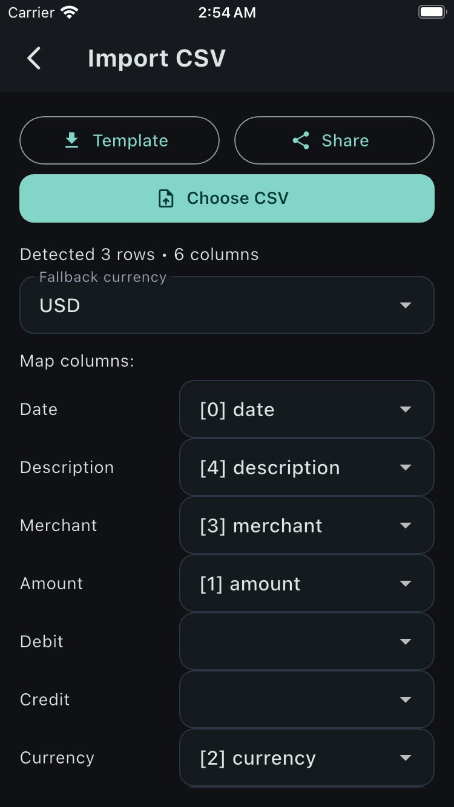
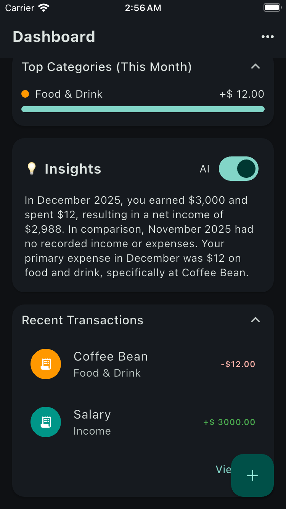
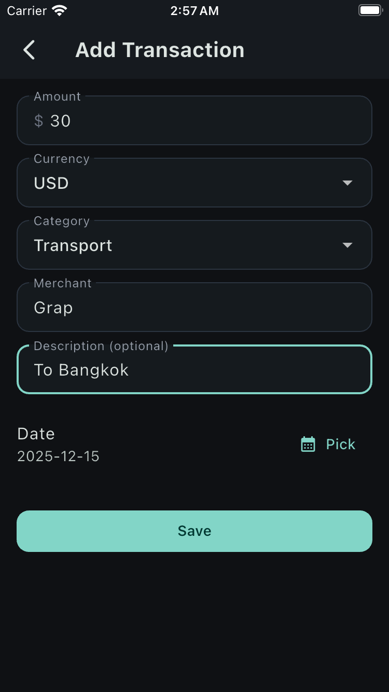
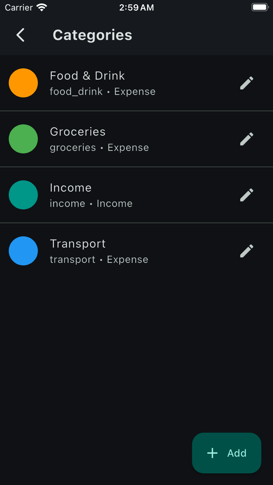
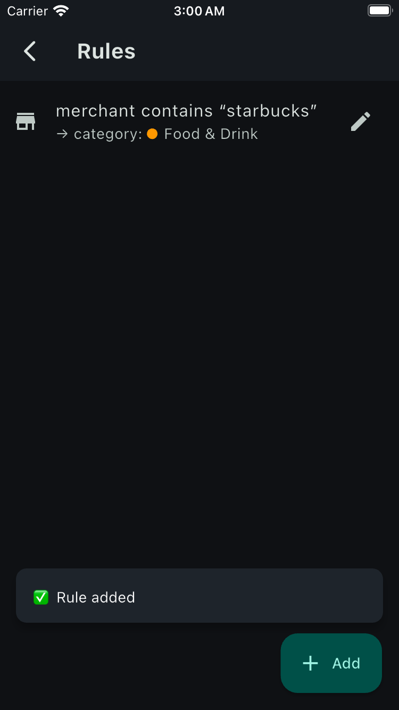

# Mini Finance Tracker

A personal finance tracker built with Flutter + Firebase, featuring CSV import, rule-based categorization, real-time insights, and optional AI-generated summaries.

Mini Finance Tracker is a cross-platform personal finance app designed to make expense tracking simple, flexible, and future-proof.

Unlike typical expense apps, this project focuses on:

- CSV import from banks or spreadsheets
- Transparent rule-based categorization
- Clear monthly insights
- Optional AI-generated summaries (privacy-safe via proxy)

This project was built as a **portfolio-grade application**, emphasizing clean architecture, scalability, and real-world usability.

## Features

### Core

- Dashboard with monthly income, expenses, and net balance
- Transaction list with filtering by date range
- Add, edit, delete transactions
- Undo delete support

### CSV Import

- Import transactions from CSV files
- Flexible column mapping (date, amount, debit, credit, merchant, category)
- Auto-detect transaction direction (income vs expense)
- Rule-based auto categorization during import
- Preview before import
- Supports both `amount` and `debit / credit` CSV formats

### Categories & Rules

- Custom categories (Income / Expense)
- Rule engine (match by merchant or description)
- Rules applied to both manual entry and CSV import

### Insights

- Monthly insights (top category, top merchant, comparisons)
- Optional AI-generated financial summary
- AI calls proxied via secure backend (no API key in app)

### UX & Quality

- Light & Dark themes
- Shimmer loading placeholders
- Responsive layout (mobile & tablet)
- Real-time updates via Firestore

## Screenshots

| Dashboard                               | CSV Import                            | Insights                              |
| --------------------------------------- | ------------------------------------- | ------------------------------------- |
|  |  |  |

| Transactions                                  | Categories                                | Rules                           |
| --------------------------------------------- | ----------------------------------------- | ------------------------------- |
|  |  |  |

## Why This Project?

Most finance apps lock users into rigid data formats and opaque categorization.

This project was built to explore and solve real-world problems such as:

### CSV-First Thinking

Banks export data in different CSV formats.
Instead of forcing one structure, this app allows:

- Column mapping
- Debit / credit or amount-based imports
- Safe previews before committing data

### Deterministic Rules Over Magic

Instead of hidden AI logic:

- Users define explicit categorization rules
- Rules apply consistently to manual entry and imports
- Results are predictable and debuggable

### AI as an Optional Enhancement

AI is used **only as a layer on top**:

- Local insights work without AI
- AI summaries are optional
- API keys are never embedded in the app
- Calls go through a secure proxy backend

### Built Like a Real Product

The architecture emphasizes:

- Separation of concerns
- Riverpod state management
- Reactive streams
- Scalable data models
- Real production trade-offs

## Tech Stack

### Frontend

- Flutter
- Riverpod
- Material 3
- Shimmer

### Backend

- Firebase Auth
- Cloud Firestore

### AI (Optional)

- OpenAI API (via secure Vercel proxy)

### Architecture

- Feature-based folder structure
- Repository pattern
- Immutable data models
- Stream-driven state

## Continuous Integration (CI)

- This project includes a GitHub Actions CI pipeline.

  - CI Pipeline Runs On:
  - Every push to main

- Every pull request
  - CI Checks:
  - Flutter setup (stable)
  - Dependency installation
  - flutter analyze
  - flutter test
  - Android APK build (debug)

## Running Locally

```bash
flutter pub get
flutter run -t lib/main_dev.dart

flutter run -t lib/main_dev.dart \
  --dart-define=AI_PROXY_URL=https://mini-finance-tracker.vercel.app/api/ai-insights

```

## Security

- No API keys are embedded in the mobile app
- AI requests are routed through a secure backend proxy
- Firebase Auth is required for all user data

## Future Improvements

- Bank import presets
- Budget limits & alerts
- Charts for category trends
- Export to CSV
- Multi-account support

## Final Notes

This project was built as a real-world portfolio application, not a tutorial clone.
Design decisions intentionally favor clarity, extensibility, and long-term maintainability.
